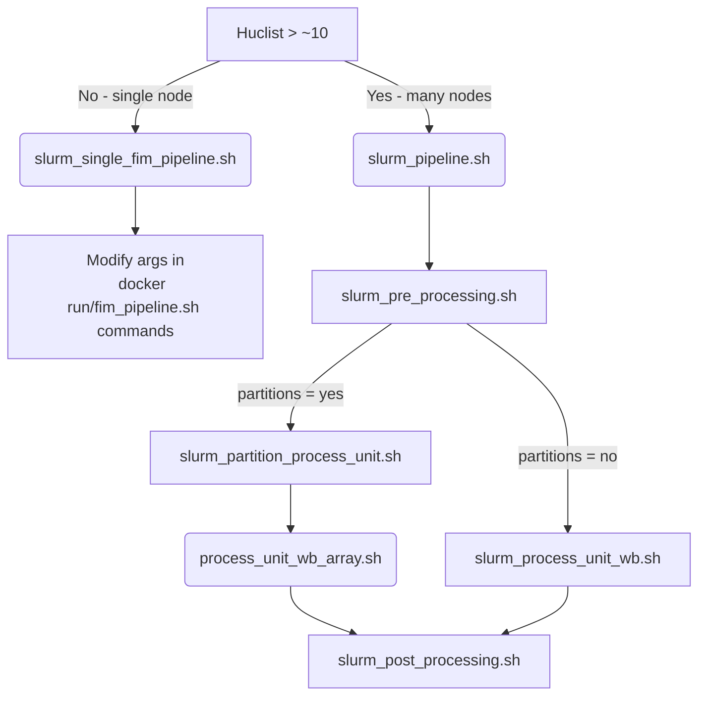

# FIM HAND Dataset Generation using slurm on PW 
### Intro:

This directory contains the requisite scripts to use a slurm scheduler to generate HAND FIM Datasets using the existing scriptss contained within the larger repository. At the time of writting, these slurm scripts are configured to run on the Parallel Works Cloud HPC environment. Modifications will be necessary to extend these scripts to run on other HPC architectures. 

There are a few necessary requirements for this workflow to run smoothly.  The PW Cluster Definition must be configured in a very particular manner, otherwise the scripts will not work. In terms of seeding input data in a Filesystem, this is dependent on the Cloud Service Provider being used.  For the cluster `Mount Point`, `/efs` is the easiest to conform with the current version of the scirpts. The `compute_<number>` partitions follows a strict naming convention, and the correct quantity of those partitions must be available as well.

**Please be advised that in using any of the scripts as is in this directory, you must have the docker image named `fim:latest` available for use.**
    This can be accomplished by selecting a PW cloud snapshot (AMI) for the 'Elastic Image' field on your cluster that pulls it, or you can build the docker image yourself within the compute node (not recommended). 

**Also, the docker volume mount for the `/foss_fim` directory must be updated in all scripts to reflect the location & version of inundation-mapping intended for use.**

## Prerequisite PW resources:

An PW 'Storage' provisioned and accessible. (eg: fimtest or fimefs)
    The 'Storage' is used for input data, and the output path - where the FIM HAND Data will be copied to after computations are completed. 

Ephemeral Storage (Optional):

An AWS FSX for Lustre provisioned and accessible. (eg: fsx)
	
FSX can be set up as an ephemeral filesystem that may provide a faster platorm for the computations, but will not be used to persist the generated data. The FSX can be configured to mount an S3 Bucket. The S3 URI should match what was output as the bucket_name = “”, when provisioning the S3 bucket in the PW platform (not what is visible as the name in the PW UI.)

## PW Cluster Configuration:
Refer to auxillary documentation for cluster configuration, as this will change based on PW account (Test, Optimization) being used, as well as the Cloud Service Provider. 

## Start the Cluster:
Find your desired cluster under the HOME tab, and My Compute Resources.
Click the power button.
Please note that the power button is essentially a Terraform apply or Terraform destroy, depending on the state. For those not familiar with Terraform, that means the resource is provisioned and de-provisioned, so all files and folders (not located on the storage) will not persist. 

Then you can click the `\<username>@\<ip of cluster>` to copy it to your clipboard:

## Connecting to the Cluster Controller Node:

From there, click on the terminal icon at the very top right of the webpage:

You now have a Terminal window that is connected to the PW “User Container” (not the cluster).

Now type `ssh`, and paste the contents of your clipboard from Start the Cluster step above:

From the Controller node, you can ensure that the mounts were successful:

```bash
ls /efs
df -h 
```

Clone this repository and copy the necessary scripts to your home directory:

```bash
git -c http.sslVerify=false clone https://gitlab.sh.nextgenwaterprediction.com/NGWPC/fim_misc
cd fim_misc/
cp slurm/* $HOME
cd $HOME
```

## Parallel Processing using slurm scheduler from Head Node

### How to execute `slurm_pipeline.sh`
Calling `slurm_pipeline.sh` is the easiest way to run the model and produce HAND FIM datasets for larger domains using slurm on Parallel Works. It will call the necessary underlying slurm wrapper scripts (pre, process unit, post), and takes command line arguments directly. It can be run from the controller node, which allows one to skip the necessary [steps](#Connecting-to-a-Compute-Node) if running interactively. 

If provided, the `-p` or `--partition` argument splits the larger huc list into chunks, which are turned into `p` * array jobs. Processing of each chunk will be in a seperate partition, and those partitions correlate to different Availability Zones. **Be sure to do the math and ensure you have enough compute nodes available in each partition based on the amount of HUC8s submitted, accounting for the remainder.** Some general rules:

`-p <n>` should divide the huc list into 'chunks' less than or equal to the `Max Nodes` value provided per partition (specified in the Compute Cluster Definition) 

`-p <n>` should ideally evenly divide the amount of hucs in the huclist (or give the least amount of remaining hucs)


The use of partitions here mitigates requesting too many resources in any one AZ.

There are a couple of important considerations that need to be understood in order to effectively use this script. 
Depending on the domain size, it may be advised to use `slurm_single_fim_pipeline.sh`, see below for additional details. 

If your domain size (amount of hucs in the `huc_list.lst` file) is roughly above 10, using `slurm_pipeline.sh` is the preferred method. 

Here is an example, see the `usage` function within the script for more options/information:

```bash
./slurm_pipeline.sh -u /data/inputs/huc_lists/dev_small_test_4_huc.lst -n test_slurm_pipeline -jb 10 -p 5
```
### Flow chart of script execution 



Please see the comments, as well as the child `.sh` (sbatch) files to gain a better awareness of the procedues used before issuing a run.


## Serial Processing 

### Using slurm from the controller node

`slurm_single_fim_pipeline.sh` should be used to issue smaller domain (a single up to a handful of HUC8s) runs on one compute node. 


### Connecting to a Compute Node:
#### Use these steps to issue Docker run command interactively and direcly call fim_pipeline.sh 

The Controller node would traditionally kick of Slurm Jobs, but in the case of just running on one Compute Node, we need to spin up an interactive Compute Node to issue the script (run on a docker container) that will generate the datasets.

Allocate an interactive compute node
```
salloc --cpus-per-task=1
```

Get JOB ID
```
squeque
```

Collect the Job Id from squeue output (replace <JOB_ID> below) & connect to compute node
```
srun --pty --jobid <JOB_ID> /bin/bash
```

You can verify these two steps were done correctly in two ways: 

    1.) The first will be the most obvious. You should have an updated terminal prompt with @compute included.

    2.) The second is from viewing the amount of active nodes as viewed from the HOME tab in PW (unclick terminal Icon).

From there, you can modify the docker run command (as well as `fim_pipeline.sh` command) to suit your requirements. 
